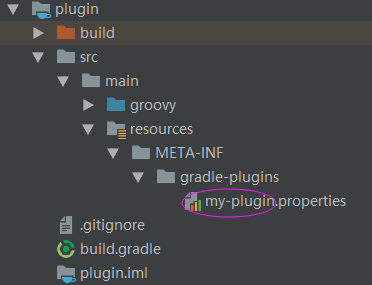
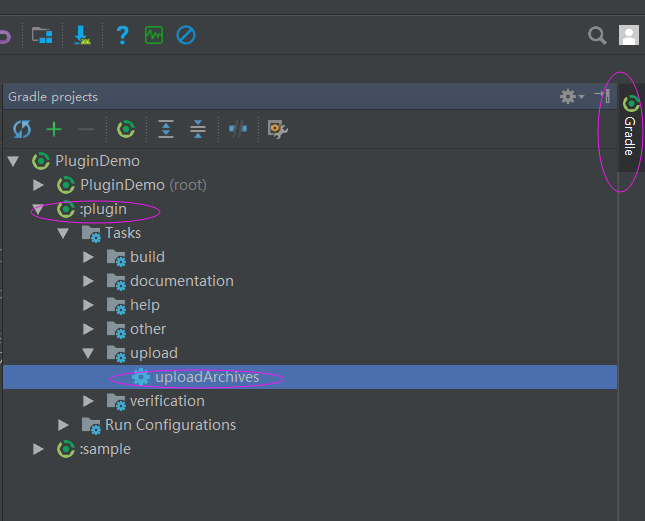
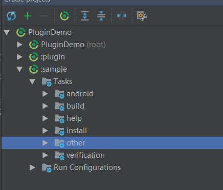
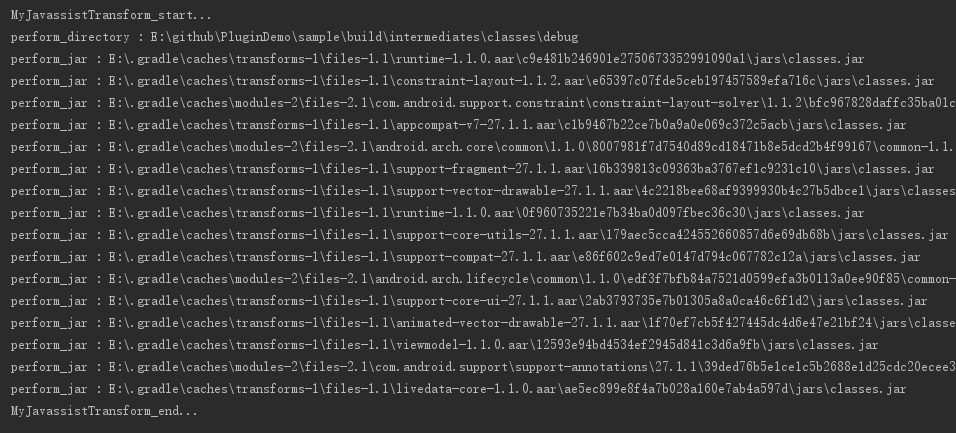
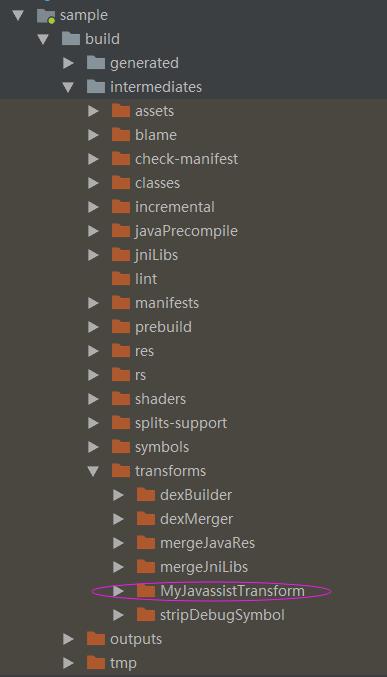
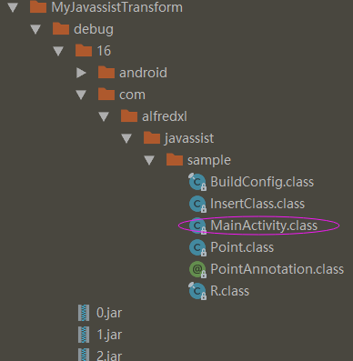
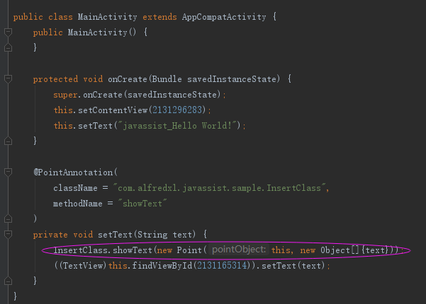

# javassist Demo
这里主要介绍一些javassist在Android中的基本使用方法，以及一个简单的实例；
在做这个Demo时，也从网络上获取过相关知识，只是大部分都是copy的，没有很大的参考价值，而且坑也比较多，这里主要就是记录采坑记吧！
## 一、准备工作：
#### 1、新建一个android项目，然后添加一个LibraryModule，我们的插件就在这个module中开发了<br>
#### 2、在LibraryModule的gradle文件中改成如下代码<br>
```groovy
apply plugin: 'groovy'
apply plugin: 'maven'

//group = 'com.github.alfredxl' //这里是你的github地址，如果使用jitpack发布该插件，这里需要填上你自己的github地址
dependencies {
    compile gradleApi()
    compile localGroovy()
    compile 'com.android.tools.build:gradle:3.1.4'
    compile 'org.javassist:javassist:3.20.0-GA'
    // 这里可以添加你如果用到的第三方包
}

repositories {
    google()
    jcenter()
}
//下面的配置是为了发布到本地，发布到本地主要是测试方便
uploadArchives {
    repositories.mavenDeployer {
        repository(url: uri('../localGradlePlugin'))//打包存放的位置，这里存放在Module的同级位置
        pom.groupId = 'com.github.alfredxl'//包名
        pom.artifactId = 'testjavassist'//在需要引用插件时用到
        pom.version = '1.0.0'//插件版本
    }
}
```
#### 3、删除Module下多余的文件和文件夹，保留如下截图的文件结构：<br>

<br>

其中图中画红圈的地方的命名将是后面讲到的plugin的名称，后面将会详细讲到，我们打开这个文件，里面会直接链接到你开发的插件类：
```groovy
implementation-class=com.bi.MyPlugin
```
在本例中，插件代码类就是MyPlugin


## 二、开发知识：
#### 1、定义类实现Plugin接口：<br>
```groovy
class MyPlugin implements Plugin<Project> {
    @Override
    void apply(Project project) {

        def android = project.extensions.findByType(AppExtension.class)
        android.registerTransform(new MyJavassistTransform(project))

    }
}
```

这里定义了MyPlugin类实现Plugin接口，然后注册Transform，在transform中你就可以做你想做的事情了     
这里还要提到的就是关于Project，Project大家有必要熟悉下，可以查看[官网](https://docs.gradle.org/current/javadoc/org/gradle/api/Project.html)   
#### 2、定义类继承Transform：<br>
```java
public class MyJavassistTransform extends Transform {
    private Project project;

    public MyJavassistTransform(Project project) {
        this.project = project;
    }

    @Override
    public String getName() {
        return "MyJavassistTransform"; //在Tasks中的名称
    }

    @Override
    public Set<QualifiedContent.ContentType> getInputTypes() {
        return TransformManager.CONTENT_CLASS;
    }

    @Override
    public Set<? super QualifiedContent.Scope> getScopes() {
        return TransformManager.SCOPE_FULL_PROJECT;
    }

    @Override
    public boolean isIncremental() {
        return false;
    }

    @Override
    public void transform(TransformInvocation transformInvocation) throws IOException {
        System.out.println("MyJavassistTransform_start...");
        Collection<TransformInput> inputs = transformInvocation.getInputs();
        TransformOutputProvider outputProvider = transformInvocation.getOutputProvider();
        // 删除上次编译目录
        outputProvider.deleteAll();
        try {
            ClassPool mClassPool = new ClassPool(ClassPool.getDefault());
            // 添加android.jar目录
            mClassPool.appendClassPath(AndroidJarPath.getPath(project));
            Map<String, String> dirMap = new HashMap<>();
            Map<String, String> jarMap = new HashMap<>();
            for (TransformInput input : inputs) {
                for (DirectoryInput directoryInput : input.getDirectoryInputs()) {
                    // 获取output目录
                    File dest = outputProvider.getContentLocation(directoryInput.getName(),
                            directoryInput.getContentTypes(), directoryInput.getScopes(),
                            Format.DIRECTORY);
                    dirMap.put(directoryInput.getFile().getAbsolutePath(), dest.getAbsolutePath());
                    mClassPool.appendClassPath(directoryInput.getFile().getAbsolutePath());
                }

                for (JarInput jarInput : input.getJarInputs()) {
                    // 重命名输出文件
                    String jarName = jarInput.getName();
                    String md5Name = DigestUtils.md5Hex(jarInput.getFile().getAbsolutePath());
                    if (jarName.endsWith(".jar")) {
                        jarName = jarName.substring(0, jarName.length() - 4);
                    }
                    //生成输出路径
                    File dest = outputProvider.getContentLocation(jarName + md5Name,
                            jarInput.getContentTypes(), jarInput.getScopes(), Format.JAR);
                    jarMap.put(jarInput.getFile().getAbsolutePath(), dest.getAbsolutePath());
                    mClassPool.appendClassPath(new JarClassPath(jarInput.getFile().getAbsolutePath()));
                }
            }
            for (Map.Entry<String, String> item : dirMap.entrySet()) {
                System.out.println("perform_directory : " + item.getKey());
                Inject.injectDir(item.getKey(), item.getValue(), mClassPool);
            }

            for (Map.Entry<String, String> item : jarMap.entrySet()) {
                System.out.println("perform_jar : " + item.getKey());
                Inject.injectJar(item.getKey(), item.getValue(), mClassPool);
            }
        } catch (Exception e) {
            e.printStackTrace();
        }
        System.out.println("MyJavassistTransform_end...");
    }
}
```

这个类里面的逻辑，其实是基本可以套娃的，不过这里面也是很多坑，花了很多时间来解决，需要注意的就有如下几点:  
> 1. 这里有个输入和输出路径，我们一定要注意的是我们不能更改输入路径的文件，只能改输出路径的文件，这些输出路径的文件   
将作为下个transorm的输入路径;(网络上大部分照搬的文章都是改的输入路径的文件，这是个大坑，不知道相关作者是否真有试验过)
> 2. ClassPool可以看作是类的加载器，要预先设置加载的路径，这里的坑就是我们要注意添加类的加载路径的时机，   
为了在编辑类的时候不会报错，我们这里先遍历了整个项目的依赖和源码（如果导入时机不对，就会找不到类）
> 3. ClassPool可以采用级联方式，这里网络上也有很多介绍，避免内存溢出，不多做介绍   
> 4. 翻看了很多文章，在处理jar的代码插入上，很多文章上都是先解压，再打包，这其实是一个巨坑，我们都知道解压和压缩是非常耗时的，    
后来，还是查阅了很多插件源码，找到一种可行的方案，就是以流的形式读取压缩包jar，然后把流交给javassist去修改，修改后转化成输    
出流，以这种形式，  基本上能够媲美直接复制的速度了， 介于该方式的速度快，在对class文件的拷贝上，也把拷贝的过程改成流的修改   
过程，从而解决了整个插件运行速度上的问题；


#### 3、定义代码的插入逻辑：<br>

代码的插入，关于javassist的语法这里推荐[简书文章](https://www.jianshu.com/p/43424242846b)   
demo中有这样一个需求，我们看sample中定义了一个注解类PointAnnotation，注解类中主要有className,以及MethodName
这个className和methodName可以用来组成在注解方法上插入的语句，我们看这个注解类标注的地方的代码块:
```java
@PointAnnotation(className = "com.alfredxl.javassist.sample.InsertClass", methodName = "showText")
    private void setText(String text) {
        ((TextView) findViewById(R.id.textView)).setText(text);
    }
```

在ManActivity类中的一个方法上我们添加了这个注解，根据这个注解的参数，我们最后插入的代码的效果应该如下:
```java
@PointAnnotation(className = "com.alfredxl.javassist.sample.InsertClass", methodName = "showText")
    private void setText(String text) {
        InsertClass.showText(new Point(this, new Object[]{text}));
        ((TextView) findViewById(R.id.textView)).setText(text);
    }
```

这个示例本身比较简单，就是在标注有特殊注解的方法上，插入语句，便于项目的隔离；也是AOP概念的体现；

插件编写完毕，由于定义了本地插件发布，我们可以在右侧的gradle视图中，点击upload发布，如下图：



接下来就是在sample中添加这个插件了，插件的添加 需要在项目的目录gradle下配置仓库地址，并引入包，配置如下:
```groovy
buildscript {
    
    repositories {
        google()
        jcenter()
        maven {
            url uri('localGradlePlugin') //仓库地址
        }
    }
    dependencies {
        classpath 'com.android.tools.build:gradle:3.1.4'
        classpath 'com.github.alfredxl:testjavassist:1.0.0' // 我们在插件中定义的报名、插件名、版本号

        // NOTE: Do not place your application dependencies here; they belong
        // in the individual module build.gradle files
    }
}
```

然后在sample的gradle中添加插件：
```groovy
apply plugin: 'my-plugin'
```

添加完毕，我们同样可以在gradle视图中，去执行测试这个插件：




双击执行，看打印结果



我们也可以到sample的build文件夹下查看编译后的代码：







到这里，javassist在Android中的基本使用也就基本结束了。

## 三、总结：

对于javassist在android中的应用，可以找的资料也不是很多，所以大部分还是要多参考其它一些优秀的项目，  
这里提供一个[插件发布平台](https://plugins.gradle.org/)，可以在里面看到一些优秀的项目，本篇就写到这里。 
email:765947965@qq.com